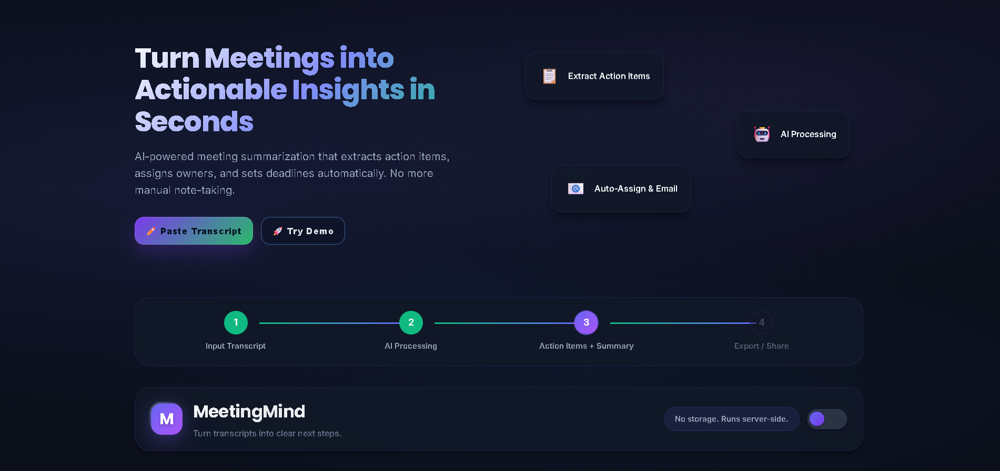
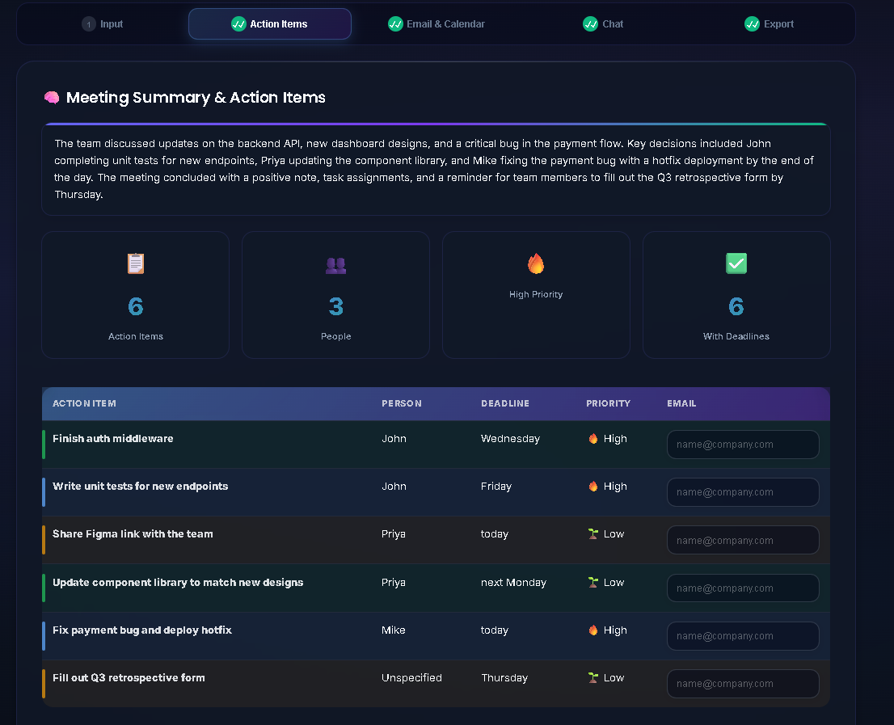
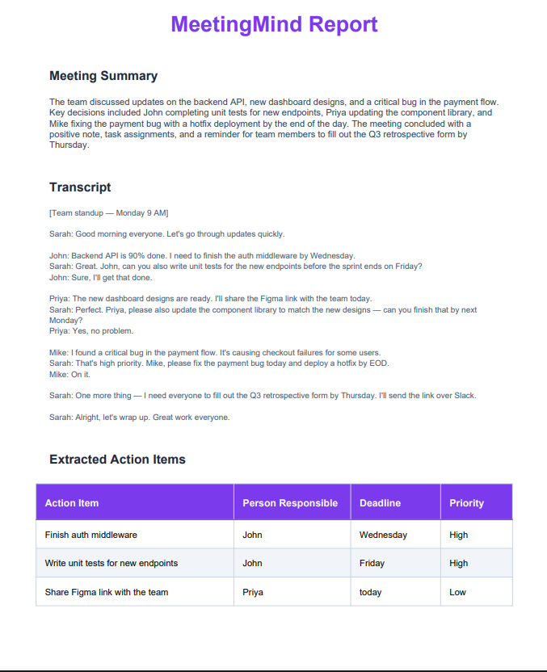
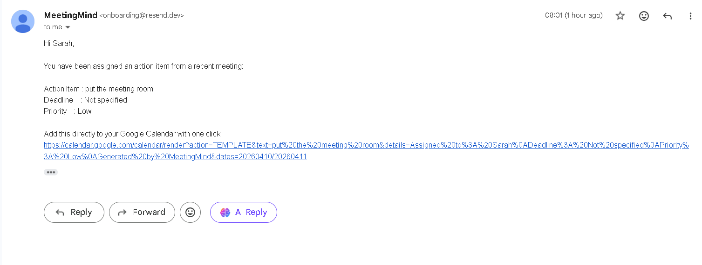

# MeetingMind 🧠
> AI-powered meeting assistant that turns any transcript into structured 
> action items, summaries, calendar events, and automated emails — in seconds.


## 🌐 Live Demo

🚀 **Try it live:** https://meetingmind-jxb3.onrender.com

> Note: First load may take 30-50 seconds as the 
> free server wakes up. Please be patient!

---

## 🚀 What is MeetingMind?

MeetingMind is an AI-powered meeting assistant that eliminates the most 
painful part of every meeting — manually tracking who needs to do what, 
by when, and following up with everyone.

Paste any meeting transcript (or upload audio, or drop a YouTube link) 
and MeetingMind instantly:
- Extracts every action item
- Assigns it to the right person
- Detects deadlines and priority levels
- Emails all assignees automatically
- Exports to Google Calendar, PDF, and Excel

---

## ✨ Features

| Feature | Description |
|---|---|
| 🤖 AI Action Item Extraction | Extracts who does what by when using LLaMA 3.3 70B |
| 📊 Meeting Summary | Auto-generates a concise 2-3 sentence summary |
| 🎙️ Audio Transcription | Upload mp3/mp4/wav/m4a — transcribed via Groq Whisper API in seconds |
| 📺 YouTube Integration | Paste a YouTube URL to fetch transcript automatically |
| 📧 Email Assignees | Send action items to assignees via Resend — no login needed |
| 📅 Calendar Export | Download .ics file for Google Calendar, Outlook, Apple Calendar |
| 📄 PDF Export | Professional branded PDF report with summary and action items |
| 📊 Excel Export | Color-coded Excel file with priority highlighting |
| 💬 Chat with Meeting | Ask follow-up questions about the transcript |
| ✏️ Editable Items | Fix AI mistakes inline before exporting |
| 🌗 Dark / Light Mode | Full theme support |

---

## 🛠️ Tech Stack

| Layer | Technology |
|---|---|
| Backend | Flask (Python) |
| AI Extraction & Chat | Groq API — LLaMA 3.3 70B |
| Audio Transcription | Groq Whisper API (whisper-large-v3) |
| Email Delivery | Resend API |
| PDF Generation | ReportLab |
| Excel Generation | OpenPyXL |
| YouTube Transcripts | youtube-transcript-api |
| Frontend | HTML + CSS + Vanilla JavaScript |

---

## ⚙️ Setup & Installation

### Prerequisites
- Python 3.10+
- A Groq API key (free at https://console.groq.com)
- A Resend API key (free at https://resend.com)

### 1. Clone the repository
```bash
git clone https://github.com/yourusername/MeetingMind.git
cd MeetingMind
```

### 2. Create and activate virtual environment

**Windows (PowerShell):**
```powershell
py -m venv .venv
.\.venv\Scripts\Activate.ps1
```

**Mac/Linux:**
```bash
python3 -m venv .venv
source .venv/bin/activate
```

### 3. Install dependencies
```bash
pip install -r requirements.txt
```

### 4. Create .env file
Create a `.env` file in the project root:
```
GROQ_API_KEY=your_groq_api_key_here
RESEND_API_KEY=your_resend_api_key_here
```

### 5. Run the application
```bash
python app.py
```

Then open `http://127.0.0.1:5000/` in your browser.

---

## 📖 How to Use

1. **Input your meeting**
   - Paste a transcript directly
   - Upload an audio/video file (Groq Whisper API will transcribe it in seconds)
   - Drop a YouTube URL to fetch the transcript

2. **Extract insights**
   - Click **Submit** to generate action items and meeting summary
   - AI automatically detects: person responsible, deadline, and priority

3. **Review and edit**
   - Double-click any action item to edit inline
   - Add or change assignee emails in the Email tab

4. **Share and export**
   - **Send Emails** — Automatically notifies all assignees
   - **Export PDF** — Professional report for stakeholders
   - **Export Excel** — Color-coded action items spreadsheet
   - **Export Calendar** — .ics file for Google/Outlook/Apple Calendar

5. **Chat for clarity**
   - Ask follow-up questions about the meeting in the Chat tab

---

## 📸 Screenshots

### Home Page


### Action Items Extracted


### PDF Export


### Email Sent


---

## 🔒 Environment Variables

| Variable | Required | Description |
|---|---|---|
| `GROQ_API_KEY` | Yes | API key for LLaMA 3.3 70B and Whisper transcription (get at [console.groq.com](https://console.groq.com)) |
| `RESEND_API_KEY` | Yes | API key for email delivery (get at [resend.com](https://resend.com)) |

---

## 🛡️ License

MIT License — feel free to use for personal or commercial projects.

---

## 🙏 Acknowledgments

- [Groq](https://groq.com) for blazing-fast LLaMA inference
- [Resend](https://resend.com) for simple email delivery
- [Groq Whisper API](https://console.groq.com) — Ultra-fast cloud audio transcription
- [ReportLab](https://www.reportlab.com/) for PDF generation

---

<p align="center">Built with ❤️ for teams who hate busywork</p>
